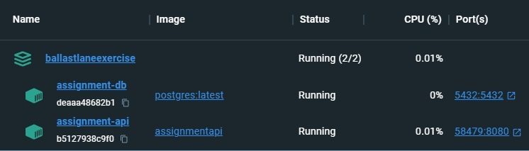

# BallastLane Technical Assignment

This repository contains the solution to the technical assignment provided by BallastLane as part of the Software Engineer hiring process.

[](https://github.com/Plluz/BallastLaneExercise/actions/workflows/dotnet.yml)

## Tech Overview

- **Clean Architecture:** To ensure separation of concerns, maintainability, and scalability.
- **.NET 8:** Harnessing the latest features and improvements in the framework.
- **Docker:** Containerized the Web API for portability and easy deployment.
- **PostgreSQL:** The database to store and manage data.
- **ADO.NET:** For database connectivity within the application.
- **JWT Tokens:** To help with authentication.
- **xUnit:** As the tool for unit testing.
- **Postman:** For testing API endpoints.

## User Story and Thought Process

- Check out a [simulated user story](docs/user-story.txt) that provides a narrative overview of the project.
- Additionally, explore a [quick thought process](docs/thought-process.txt) for technical insights and design decisions made during development.

## Postman Files

Access the [Postman Collection](docs/postman/BallastLaneAssignment.postman_collection) and [Postman Environment file](docs/postman/BallastLaneAssignment.postman_environment) to explore and test the API endpoints.

## Run locally
Before you begin, ensure you have the following tools installed on your machine:

- [Git](https://git-scm.com/downloads)
- [Docker](https://www.docker.com/get-started)

First, clone the repository:
```bash
git clone https://github.com/Plluz/BallastLaneExercise.git
cd your-repository
```

Then, while in the root folder (BallastLaneExercise), execute the following command in the terminal:
```bash
docker-compose up
```

This will start the Application and PostgreSQL containers like in the image below.



Once the containers are running, you can access the Swagger at http://localhost/swagger (or the Postman provided above).

Ports used: 80 for HTTP and 5432 for Postgres
